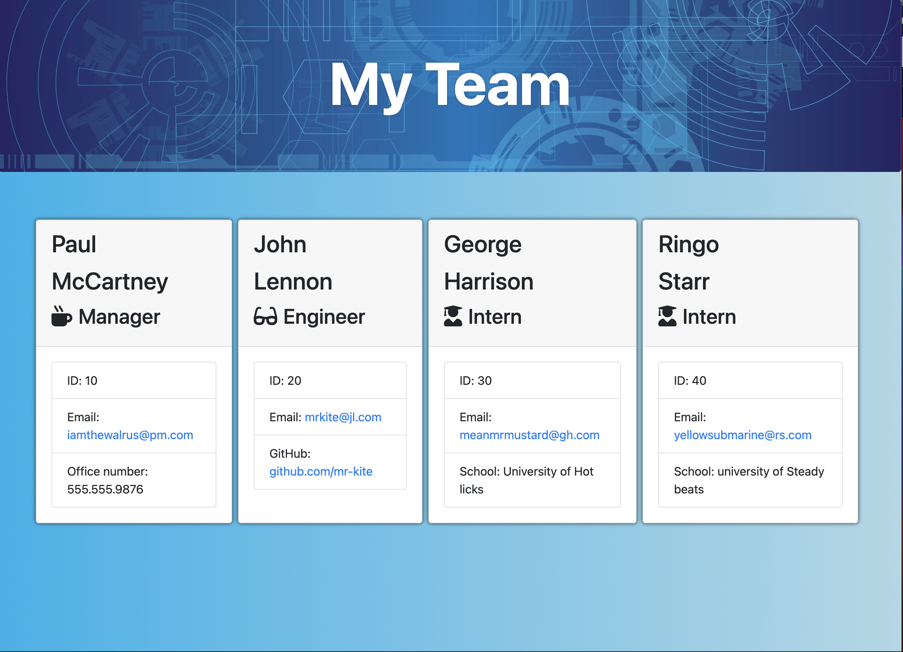
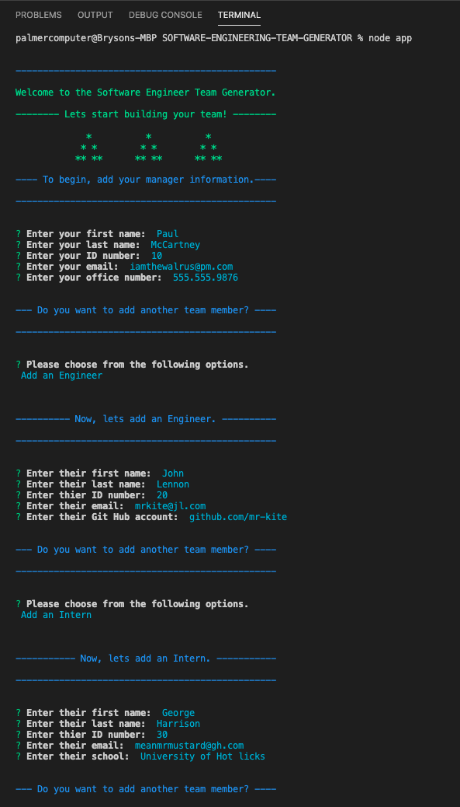
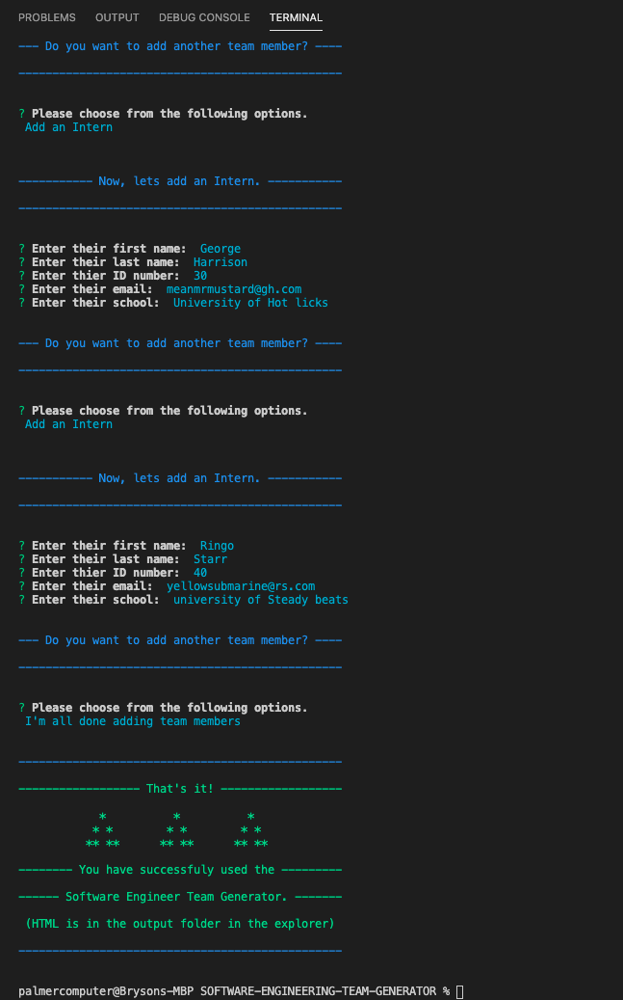

## <a id='back-to-top' > </a>
  # SOFTWARE-ENGINEERING-TEAM-GENERATOR   [](https://opensource.org/licenses/Apache-2.0)
  This application will create an HTML file that displays a webpage with a nicely formatted team roster, and their respective summaries, based on the information provided by the user in the node CLI. The application will prompt the user for information about the team manager and then information about the team members. The user can input any number of team members, and they may be a mix of engineers and interns.

  

  ## Table of Contents
  [Criteria](#criteria) </br>
  [Links](#links) </br>
  [Screenshots](#screenshots) </br>
  [Future Development](#future-development) </br>
  [Installation](#installation) </br>
  [Usage](#usage) </br>
  [License](#license) </br>
  [Contributing](#contributing) </br>
  [Tests](#tests) </br>
  [Questions](#questions) </br>

## 💼 <a id='criteria'></a> Criteria
```
As a manager
I want to generate a webpage that displays my team's basic info
so that I have quick access to emails and GitHub profiles

```
  

## 🔗 <a id='links'></a> Links
* Link to [**GitHub**](https://github.com/Bryson-Palmer/SOFTWARE-ENGINEERING-TEAM-GENERATOR.git) </br>
* Live **URL** for [**SOFTWARE-ENGINEERING-TEAM-GENERATOR**](Add a link to the live url here.) </br>
  

## 📸 <a id='screenshots'></a> Screenshots




## 🔍 <a id='future-development'></a> Future Development
* I would like to add a `favicaon` to the title tab. 

* I would also like to get this code aligned with OOP practices as much as possible. I think the app.js could build a start function around the first function called creatManager. That way I could create a new start.js, require the module, and call it. It should start the app and be about 5 lines of code.

* I would also like to practice DRY coding as much as I can. I would move the prompt questions into a function to be called for each new employee created. If I could get all the prompts in one function and use a `when` statement to determine which unique question gets asked based on which employee they picked, that would be ideal. 

* I would figure out a way to validate the inputs to make sure they meet the criteria of the question. I could use npm  `joi` or figure out how to do validation checks on the prompts.  

* Lastly, I would also think that adding a delete button would be ideal. 


## 🔧 <a id='installation'></a> Installation Instructions
* Just clone this repo down to your own local machine and run in node.


## ⚙️ <a id='usage'></a> Usage Information
* First, open an integrated terminal from your preferred IDE and path to the app.js file.
* Next, run the comand in your CLI `node app.js`.
* Next, Answer the prompts. Fill out information for the Manager first. After that, you'll be asked if you want to create an Engineer, or an Intern.
* When you're done entering new employees, then select `I'm all done` from the list of options. 
* Lastly, go to your explorer and locate the output folder. Inside you'll find your newly created team.html file. You can open that html file in your browser and see your team roster.
That's it!


## 🏆 <a id='license'></a> License
Apache License 2.0

Copyright 2020   Bryson Palmer

```
Licensed under the Apache License, Version 2.0 (the "License");
you may not use this file except in compliance with the License.
You may obtain a copy of the License at
    
    http://www.apache.org/licenses/LICENSE-2.0
    
Unless required by applicable law or agreed to in writing, software
distributed under the License is distributed on an "AS IS" BASIS,
WITHOUT WARRANTIES OR CONDITIONS OF ANY KIND, either express or implied.
See the License for the specific language governing permissions and
limitations under the License.
```

  ## 🏛️ <a id='contributing'></a> Contribution Guidelines
  * If you would like to add to this project, clone the repo down. Make your changes and create tests. All tests must pass. Make a pull request and wait for a reply. 


  ## ✅ <a id='tests'></a> Test Instructions
  * Any new code should include tests for each new action or instance. Make a test file with the same name as the js file with the word test at the end. Like, `Employee.test.js`. All tests must pass.


  ## 📡 <a id='questions'></a> Questions?
  If you have any questions or would like to follow my development, please contact me at: </br>
  * My GitHub: [Bryson-Palmer](https://github.com/Bryson-Palmer) </br>
  * My Email: [brysonpalmer@gmail.com](mailto:brysonpalmer@gmail.com) </br>

  [Back to Top](#back-to-top)
